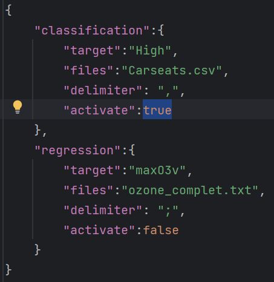
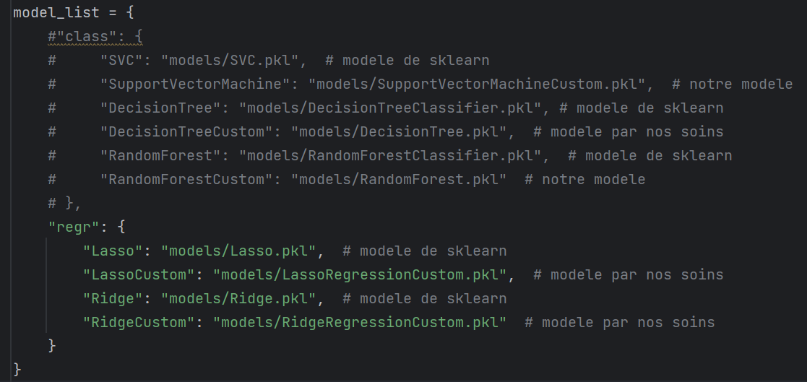
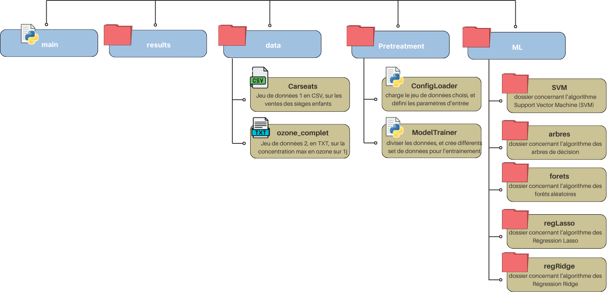

# Projet Machine Learning - Groupe 4
Ce projet est réalisé par un groupe de 5, composé de Hugo, Eienne, Julien, Nino, Ewann.
L'objectif principal est de coder en Python les algorithmes de Machine Learning suivants :

- Arbres de décision
- Forêts aléatoires
- Régression ridge
- Régression lasso
- Support Vector Machine (SVM)
Nous nous efforçons d'utiliser le moins de packages possible pour une meilleure compréhension des algorithmes.  
## Utilisation - et run du benchmark / pipeliner
Afin d'utiliser les deux scripts benchmark et pipeliner, il faut préciser quel type de modele nous allons utliliser afin de faire uns disjonction de cas en fonction.
Si nous allons utiliser un modèle de régression, il utiliser le dataset `ozone_complet` 
Si nous allons utiliser un modèle de classification, il utiliser le dataset `Carseats`

Ainsi afin d'effectuer la disjonction de cas, il faut (pour l'instant) activer le dataset correspondant dans le fichier `config.json`
'

Il faudra également mettre en commentaire, la liste des modeles que nous n'allons pas utiliser.
'
## Comparaison avec scikit-learn
Nous comparerons également nos implémentations en termes de temps d'exécution et de performance avec celles de la bibliothèque scikit-learn. Cela nous permettra de comprendre les avantages et les inconvénients de nos implémentations par rapport aux solutions standard.  
## Structure du Projet
